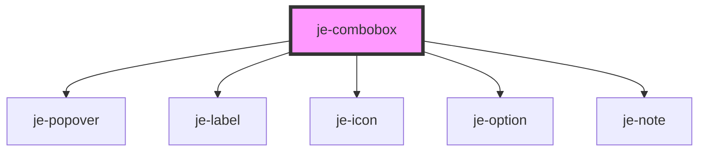

<!-- Auto Generated Below -->


## Usage

### Options

::: live-code-demo

```html
<je-combobox label="Items" placeholder="Select an item..." editable note="Select the item that you vibe with the most">
  <je-option>Item 1</je-option>
  <je-option>Item 2</je-option>
  <je-option>Item 3</je-option>
  <je-option>Item 4</je-option>
  <je-button slot="after" class="icon-only">
    <je-icon fill>edit</je-icon>
  </je-button>
</je-combobox>
```

:::


## Properties

| Property        | Attribute        | Description | Type                               | Default     |
| --------------- | ---------------- | ----------- | ---------------------------------- | ----------- |
| `disabled`      | `disabled`       |             | `boolean`                          | `false`     |
| `label`         | `label`          |             | `string`                           | `undefined` |
| `multiple`      | `multiple`       |             | `boolean`                          | `false`     |
| `note`          | `note`           |             | `string`                           | `undefined` |
| `options`       | --               |             | `{ value: any; label: string; }[]` | `undefined` |
| `originalValue` | `original-value` |             | `any`                              | `undefined` |
| `placeholder`   | `placeholder`    |             | `string`                           | `undefined` |
| `required`      | `required`       |             | `boolean`                          | `false`     |
| `size`          | `size`           |             | `"lg" \| "md" \| "sm"`             | `"md"`      |
| `value`         | `value`          |             | `any`                              | `undefined` |


## Events

| Event         | Description | Type               |
| ------------- | ----------- | ------------------ |
| `valueChange` |             | `CustomEvent<any>` |


## Shadow Parts

| Part        | Description |
| ----------- | ----------- |
| `"content"` |             |


## Dependencies

### Depends on

- [je-popover](../je-popover)
- [je-label](../je-label)
- [je-icon](../je-icon)
- [je-option](../je-option)
- [je-note](../je-note)

### Graph


----------------------------------------------


