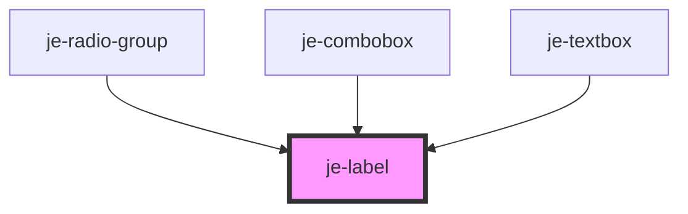

<!-- Auto Generated Below -->

## Properties

| Property   | Attribute  | Description | Type      | Default     |
| ---------- | ---------- | ----------- | --------- | ----------- |
| `required` | `required` |             | `boolean` | `undefined` |

## Dependencies

### Used by

 - [je-radio-group](../je-radio-group)
 - [je-combobox](../je-combobox)
 - [je-textbox](../je-textbox)

### Graph

----------------------------------------------

