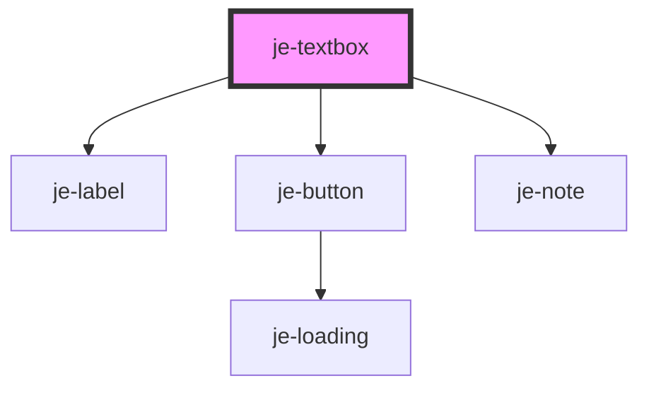

<!-- Auto Generated Below -->


## Usage

### 

::: live-code-demo

```html
<je-stack>
  <je-textbox type="phone" value="2705569657">
    <je-label slot="label">Phone number</je-label>
  </je-textbox>
  <je-textbox required placeholder="Type your name..." label="Full Name"></je-textbox>
  <je-textbox type="password" label="Password"></je-textbox>
  <je-textbox type="money" label="Money"></je-textbox>
  <je-textbox type="ssn" label="SSN"></je-textbox>
  <je-textbox type="number" label="Number"></je-textbox>
  <je-textbox type="time" label="Time"></je-textbox>
  <je-textbox type="date" label="Date"></je-textbox>
  <je-textbox type="datetime" label="Date & Time"></je-textbox>
  <je-textbox type="daterange" label="Date Range"></je-textbox>
  <je-textbox type="email" label="Email"></je-textbox>
  <je-textbox type="url" label="URL"></je-textbox>
</je-stack>  
```

:::

::: live-code-demo

```html
<form id="test-form">
  <je-stack>
    <je-textbox name="name" required placeholder="Type your name..." label="Full Name"></je-textbox>
    <label>
      <span>Are you under 18?</span>
      <input type="checkbox" name="isMinor" value="yes"/>
    </label>
    <je-stack>
      <je-label>Colors</je-label>
      <label>
        <span>Red</span>
        <input type="checkbox" name="colors[]" value="red"/>
      </label>
      <label>
        <span>Blue</span>
        <input type="checkbox" name="colors[]" value="blue"/>
      </label>
      <label>
        <span>Green</span>
        <input type="checkbox" name="colors[]" value="green"/>
      </label>
    </je-stack>
    <button type="submit">Submit</button>
  </je-stack>  
</form>
```

```javascript
const form = document.querySelector('#test-form')
form.addEventListener('submit', ev => {
  ev.preventDefault()
  console.log(Array.from(ev.target.elements))
  const formData = new FormData(form)
  for (const [key, value] of formData.entries()) 
    console.log(key, value)
})
form.oninvalid = console.log
```

:::


## Properties

| Property        | Attribute        | Description                                                                                                                  | Type                                                                                                                                                                                     | Default     |
| --------------- | ---------------- | ---------------------------------------------------------------------------------------------------------------------------- | ---------------------------------------------------------------------------------------------------------------------------------------------------------------------------------------- | ----------- |
| `debounce`      | `debounce`       | Optional debounce of the didInput event                                                                                      | `number`                                                                                                                                                                                 | `0`         |
| `disabled`      | `disabled`       | Renders input as disabled and prevents changes                                                                               | `boolean`                                                                                                                                                                                | `false`     |
| `label`         | `label`          | Text above the control                                                                                                       | `string`                                                                                                                                                                                 | `undefined` |
| `max`           | `max`            | Passed to native input                                                                                                       | `any`                                                                                                                                                                                    | `undefined` |
| `maxlength`     | `maxlength`      | Passed to native input                                                                                                       | `number`                                                                                                                                                                                 | `undefined` |
| `min`           | `min`            | Passed to native input                                                                                                       | `any`                                                                                                                                                                                    | `undefined` |
| `minlength`     | `minlength`      | Passed to native input                                                                                                       | `number`                                                                                                                                                                                 | `undefined` |
| `multiline`     | `multiline`      | Whether the control is a multiline textarea                                                                                  | `boolean`                                                                                                                                                                                | `false`     |
| `note`          | `note`           | Informational message directly below the control                                                                             | `string`                                                                                                                                                                                 | `undefined` |
| `originalValue` | `original-value` | The default value the control will reset to in a form. If not set, will default to the inital value of the "value" property. | `any`                                                                                                                                                                                    | `undefined` |
| `pattern`       | `pattern`        | Passed to native input                                                                                                       | `string`                                                                                                                                                                                 | `undefined` |
| `placeholder`   | `placeholder`    | Input placeholder text                                                                                                       | `string`                                                                                                                                                                                 | `undefined` |
| `readonly`      | `readonly`       | Renders input as read only and prevents changes                                                                              | `boolean`                                                                                                                                                                                | `false`     |
| `required`      | `required`       | Marks as required in form and adds asterisk to the end of the label                                                          | `boolean`                                                                                                                                                                                | `false`     |
| `size`          | `size`           | Container size                                                                                                               | `"lg" \| "md" \| "sm"`                                                                                                                                                                   | `'md'`      |
| `step`          | `step`           | Passed to native input                                                                                                       | `string`                                                                                                                                                                                 | `undefined` |
| `type`          | `type`           |                                                                                                                              | `"date" \| "daterange" \| "datetime" \| "email" \| "inputElement" \| "money" \| "number" \| "password" \| "phone" \| "search" \| "ssn" \| "text" \| "time" \| "url" \| InputMaskOptions` | `'text'`    |
| `value`         | `value`          | Current value of the input                                                                                                   | `any`                                                                                                                                                                                    | `undefined` |
| `wrap`          | `wrap`           | Passed to native textarea                                                                                                    | `string`                                                                                                                                                                                 | `undefined` |


## Events

| Event         | Description             | Type               |
| ------------- | ----------------------- | ------------------ |
| `valueChange` | Emits as the user types | `CustomEvent<any>` |


## Methods

### `isTouched() => Promise<boolean>`


#### Returns

Type: `Promise<boolean>`


### `markAsTouched() => Promise<void>`


#### Returns

Type: `Promise<void>`


## Shadow Parts

| Part                | Description |
| ------------------- | ----------- |
| `"after-container"` |             |
| `"container"`       |             |
| `"error"`           |             |
| `"input"`           |             |
| `"label"`           |             |
| `"note"`            |             |


## Dependencies

### Depends on

- [je-label](../je-label)
- [je-button](../je-button)
- [je-note](../je-note)

### Graph


----------------------------------------------


